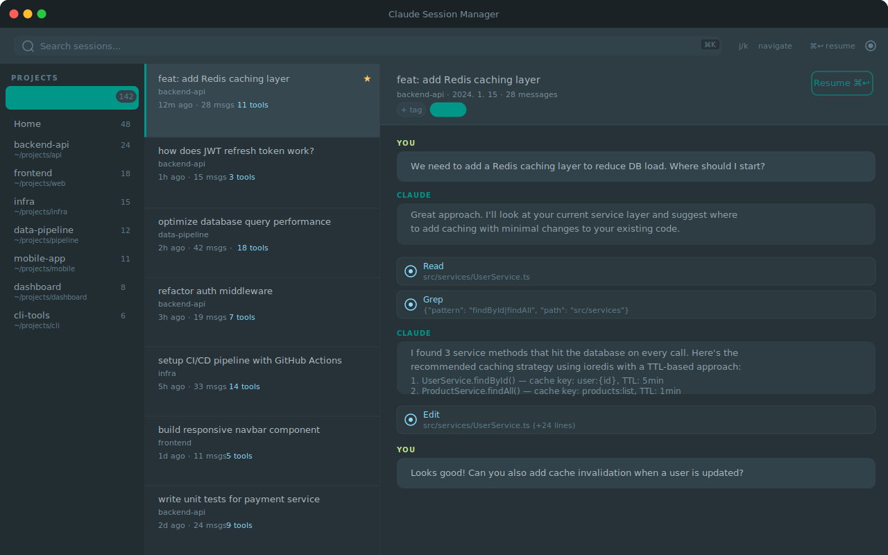

# Claude Session Manager

[English](./README.en.md)

[Claude Code](https://claude.com/claude-code) 세션을 탐색, 검색, 재개할 수 있는 데스크톱 GUI 앱입니다.



**Tauri v2** (Rust 백엔드) + **React** + **TypeScript** + **Tailwind CSS**로 구축되었습니다.

## 주요 기능

- **프로젝트별 세션 그룹핑** — 프로젝트 디렉토리 기준으로 세션을 자동 분류
- **대화 미리보기** — 도구 사용 내역이 하이라이트된 메시지 히스토리 표시
- **키보드 중심 네비게이션** — `j/k`로 이동, `⌘Enter`로 재개, `/`로 검색
- **터미널 재개** — 선택한 세션을 iTerm2에서 `claude --resume`으로 바로 열기
- **태그 & 북마크** — 세션에 태그를 붙이고 북마크로 정리
- **6가지 개발자 테마** — Material Oceanic, Material Darker, Dracula, One Dark, Night Owl, Ayu Mirage
- **세션 이름 표시** — `/rename`으로 설정한 세션 이름 자동 인식
- **빠른 Rust 파서** — 대용량 세션 파일(30MB+)도 Rust에서 스트리밍 파싱
- **인메모리 캐시** — 첫 로드 후 프로젝트 전환이 즉시 응답

## 설치

### DMG로 설치 (권장)

[Releases](https://github.com/nobel6018/claude-session-manager/releases)에서 최신 DMG를 다운로드하세요.

> **⚠️ macOS Gatekeeper 경고**
>
> Apple Developer 인증서가 없어 처음 실행 시 "손상되었기 때문에 열 수 없습니다" 경고가 뜰 수 있습니다.
> 아래 두 가지 방법 중 하나로 해결하세요.
>
> **방법 1 — 터미널에서 격리 속성 제거:**
> ```bash
> xattr -cr /Applications/Claude\ Session\ Manager.app
> ```
>
> **방법 2 — 시스템 설정에서 허용:**
> `시스템 설정` → `개인 정보 보호 및 보안` → 하단 "확인되지 않은 개발자" 항목 → **"그래도 열기"** 클릭

### 사전 요구사항

- [Rust](https://rustup.rs/) (1.70+)
- [Node.js](https://nodejs.org/) (18+)

### 개발 모드

```bash
git clone https://github.com/nobel6018/claude-session-manager.git
cd claude-session-manager
npm install
npm run tauri dev
```

### 빌드

```bash
npm run tauri build
```

빌드된 앱은 `src-tauri/target/release/bundle/`에 생성됩니다.

## 키보드 단축키

| 키 | 동작 |
|----|------|
| `j` / `↓` | 다음 세션 |
| `k` / `↑` | 이전 세션 |
| `⌘K` 또는 `/` | 검색 포커스 |
| `⌘Enter` | 터미널에서 세션 재개 |
| `⌘R` | 세션 목록 새로고침 |
| `Esc` | 검색 초기화 |

## 아키텍처

```
┌─────────────────────────────────────────────┐
│              Tauri v2 App                    │
│  ┌────────────────┐  ┌──────────────────┐   │
│  │  React Frontend │◄─┤  Rust Backend    │   │
│  │                 │  │                  │   │
│  │  - 3컬럼 UI     │  │  - JSONL 파서    │   │
│  │  - Zustand 상태 │  │  - 파일 스캐너    │   │
│  │  - 키보드 내비   │  │  - SQLite (태그)  │   │
│  │  - 테마 선택기   │  │  - 인메모리 캐시   │   │
│  └────────────────┘  └──────────────────┘   │
└─────────────────────────────────────────────┘
         데이터 소스: ~/.claude/
```

## 동작 원리

1. **스캔**: Rust 백엔드가 `~/.claude/projects/`를 스캔하여 세션 JSONL 파일 탐색
2. **파싱**: 각 JSONL 파일을 Rust에서 스트리밍 파싱, 표시에 필요한 필드만 추출
3. **캐싱**: 첫 로드 시 모든 세션을 메모리에 캐시, 이후 필터링만 수행
4. **미리보기**: 세션 선택 시 전체 메시지 히스토리를 파싱하여 React 프론트엔드에 전달
5. **재개**: AppleScript로 iTerm2 새 창을 열어 `claude --resume <sessionId>` 실행

## 라이선스

MIT
